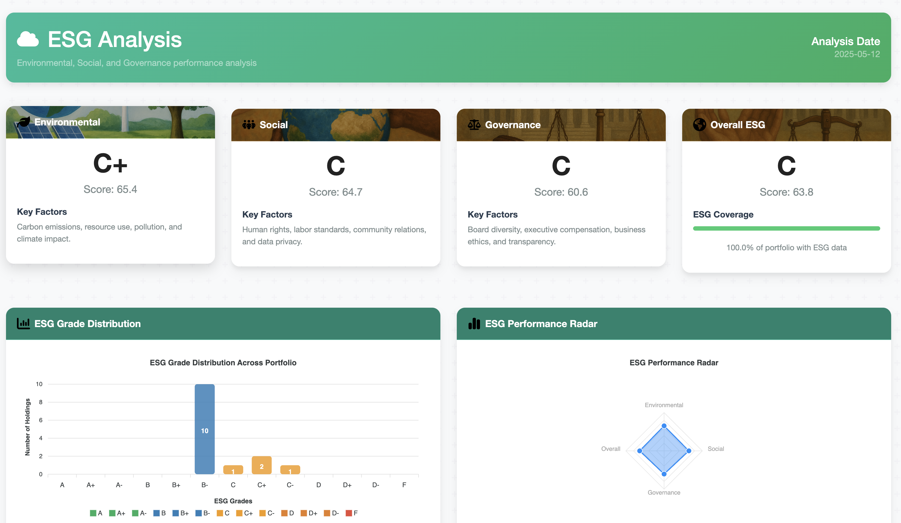
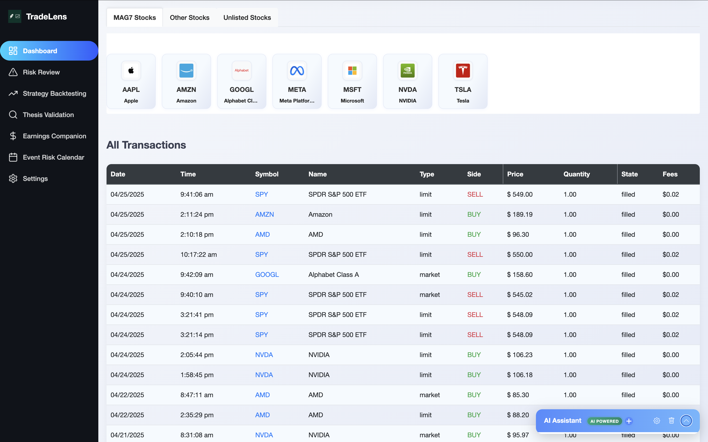

# TradeLens - AI-Powered Stock Portfolio Analysis

<div align="left">
  
</div>

TradeLens emerged as a solution to the challenges faced by investors in navigating the complexities of tariffs, market volatility, and the constant need to sift through news for portfolio-related information. This sophisticated web-based tool leverages advanced AI capabilities from Perplexity to provide a comprehensive platform for analyzing and visualizing stock portfolios. By uploading your stock transactions, you can gain valuable insights through interactive visualizations, risk assessments, and AI-driven analysis, making it easier to manage and optimize your investments amidst ever-changing market conditions.

It’s designed to help you navigate market volatility, tariff changes, and financial news—all in one place.

🌱 ESG-Driven Investing

What makes TradeLens unique is its focus on both performance and purpose. The platform includes:
- ESG (Environmental, Social, Governance) scoring and analysis
- Real-time monitoring of sustainability metrics
- Actionable suggestions to improve your portfolio’s ESG impact

Stay aligned with your values without compromising on returns.

<div align="center">
  
</div>


## 📸 Screenshots & Features

### Dashboard Overview

The main dashboard provides a comprehensive view of your portfolio performance, with interactive charts, transaction summaries, and key metrics to help you monitor your investments at a glance.

### ESG Analysis Dashboard

Comprehensive ESG (Environmental, Social, Governance) analysis of your portfolio, offering detailed sustainability metrics, company-specific ratings, and actionable recommendations to align your investments with your values and reduce long-term ESG risks.

### Stock Performance Visualization

Visualize your stock transactions with an interactive chart showing buy and sell points plotted against historical price data, making it easy to evaluate your trading decisions.

### Transaction History

A detailed view of all your transactions with sortable columns, allowing you to track your investment history and analyze your trading patterns over time.

### Perplexity AI Integration

Choose from various Perplexity AI models to power your analysis. Each model offers different capabilities, from quick answers to deep financial reasoning.

### Earnings Analysis

Track upcoming earnings announcements relevant to your portfolio with AI-enhanced insights on expected performance and potential impacts.


Get detailed AI-powered research on company earnings, helping you make informed decisions before and after earnings releases.

### Risk Assessment

Comprehensive risk analysis for your portfolio, identifying potential vulnerabilities and providing AI-powered recommendations to optimize your risk-return profile.

### Event Risk Calendar

Stay ahead of market-moving events that might impact your portfolio. The calendar highlights critical dates and provides AI-generated insights about potential market impacts.

### Investment Thesis Validation

Test and validate your investment hypotheses with AI analysis, providing deeper insights into your investment rationale.

### Strategy Backtesting

Test investment strategies against historical data to evaluate performance and refine your approach before committing capital.

### Provider Settings

Configure your API providers and settings to customize the platform according to your needs and preferences.

## Key Features

### Core Functionality
- 📊 **Interactive Visualizations**: Dynamic stock price charts with buy/sell indicators
- 📈 **Transaction History**: Comprehensive view of all your trades with performance metrics
- 🔍 **Smart Filtering**: Categorize and analyze stocks by groups (MAG7, Other, Unlisted)
- 💼 **Portfolio Composition**: Visual breakdown of asset allocation and sector exposure

### AI-Powered Analysis
- 🤖 **Perplexity API Integration**: Leveraging advanced financial analysis capabilities
  - Deep market research for investment decisions
  - Real-time financial data analysis
  - Multiple model options (sonar, sonar-pro, sonar-reasoning, etc.)
- 💡 **Investment Thesis Validation**: Test your investment hypotheses with AI analysis
- 📊 **Earnings Season Companion**: AI-driven earnings preparation and analysis
- ⚠️ **Portfolio Risk Assessment**: Identify and analyze risk factors

### ESG Insights
- 🌱 **ESG Dashboard**: Comprehensive analysis of environmental, social, and governance factors
- 🔄 **Sustainable Portfolio Alignment**: Recommendations to improve your portfolio's ESG profile
- 📊 **Sector-Specific ESG Benchmarking**: Compare holdings against industry ESG baselines
- 📝 **ESG Notes and Monitoring**: Track sustainability developments for your investments

### Advanced Features
- 📅 **Event Risk Calendar**: Track market-moving events that could impact your portfolio  
- 📈 **Strategy Backtesting**: Test investment strategies against historical data
- 🌐 **Tariff & Geopolitical Risk Analysis**: Assess external factors affecting your holdings
- 🤔 **Natural Language Queries**: Ask questions about your portfolio in plain English

## Perplexity Integration

🔹 Perplexity Integration Points

🔸 Sonar API

Used for real-time data enrichment:
	•	Inputs: Transaction history and current portfolio.
	•	Outputs: Context-aware investment signals, AI summaries, and forecasts.
	•	Chatbot uses it to respond with intelligent, context-specific financial insights.

🔸 Sonar Pro

Used for strategy reasoning:
	•	Maps historical macroeconomic events (Covid, Banking Crisis 2023, AI boom, SP500 2020) to backtrack investment outcomes.
	•	Injects context such as tariffs, supply chain risks, or market cycles into the reasoning loop.

⸻

🔹 Thesis Validation Module (Left Block)
	•	Accepts hypotheses like "Tech stocks are undervalued post-Q2 earnings" and uses Perplexity's Deep Research to:
	•	Pull analyst commentary.
	•	Evaluate recent company performance.
	•	Scan sentiment data from media and financial forums.
	•	It synthesizes:
	•	Stock name
	•	Key metrics (revenue, EPS, margin trends)
	•	Sentiment and analyst expectations

Result: Validated or refuted thesis suggestions in natural language.

⸻

🔹 Strategy Backtracking (Top Center)
	•	Uses Sonar's Reasoning Model to simulate how portfolios would have performed under past macro conditions:
	•	Covid Recovery
	•	2020 market crash and recovery
	•	AI/Tech boom
	•	2023 Banking Crisis
	•	Enables reverse testing of a current strategy against historic events.

⸻

🔹 Earnings Calendar (Bottom Left)
	•	Earnings Research module, powered by Perplexity:
	•	Adds real-time annotations and research briefs for each upcoming earnings release.
	•	Enables quick drill-down into high-impact events within your portfolio's universe.

## Getting Started

### Prerequisites

- Python 3.8 or higher
- pip (Python package installer)
- Perplexity API key (set in .env file)

### Installation

1. Clone the repository
```bash
git clone https://github.com/yourusername/tradelens.git
cd tradelens
```

2. Create and activate a virtual environment
```bash
python -m venv venv
source venv/bin/activate  # On Windows, use: venv\Scripts\activate
```

3. Install dependencies
```bash
pip install -r requirements.txt
```

4. Set up your environment variables
```bash
cp .env.example .env
# Edit .env to add your Perplexity API key
```

### Running the Application

1. Start the server
```bash
./run_server.sh
```

2. Open your browser and navigate to:
```
http://localhost:5000
```

3. Upload your transaction data and start exploring your portfolio with AI-powered insights

## Technology Stack

- **Backend**: Python, Flask
- **Frontend**: HTML, CSS, JavaScript, Chart.js
- **AI Integration**: Perplexity API
- **Data Storage**: SQLite
- **Data Processing**: Pandas, NumPy

## Documentation

Detailed documentation for TradeLens is available in the `docs/` directory:

- [User Guide](docs/user_guide/index.md) - Comprehensive user documentation
- [API Documentation](docs/api/index.md) - API reference and usage examples
- [Database Schema](docs/database/schema.md) - Database structure and relationships
- [Development Guide](docs/development/index.md) - Setup and contribution guidelines
- [Deployment Guide](docs/deployment/index.md) - Instructions for deploying TradeLens

For project structure and organization, see the [Project Structure](docs/development/project_structure.md) document.

## Contributing

Contributions are welcome! Please feel free to submit a Pull Request.
