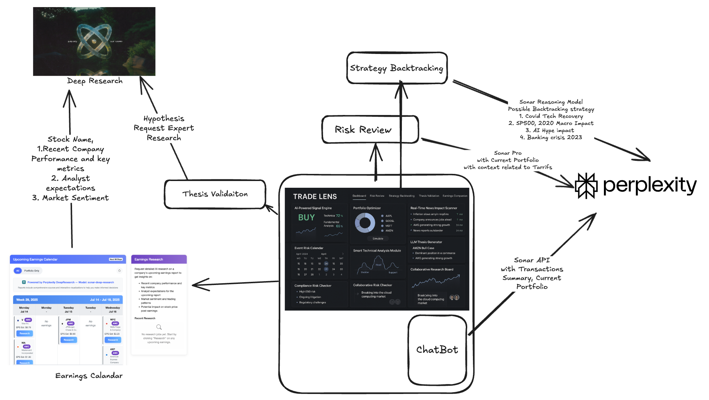
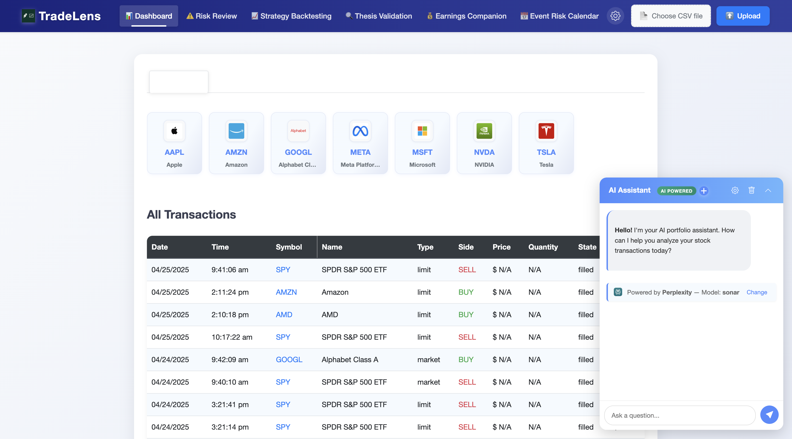
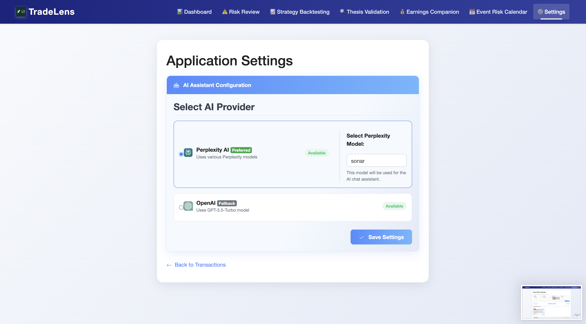
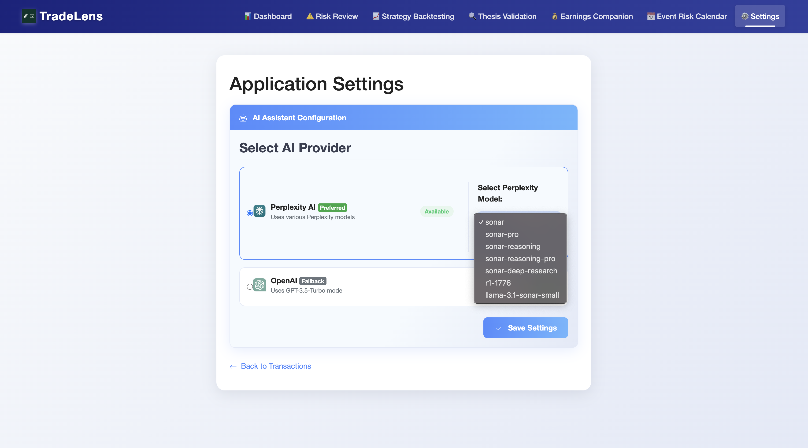
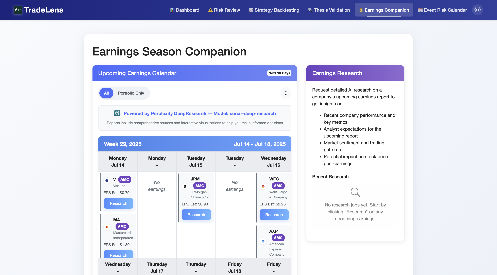
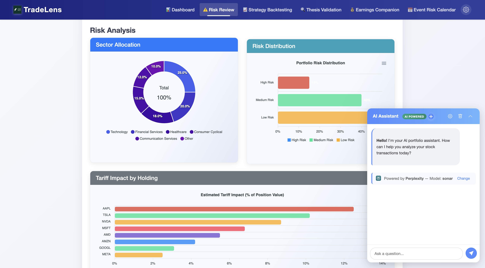
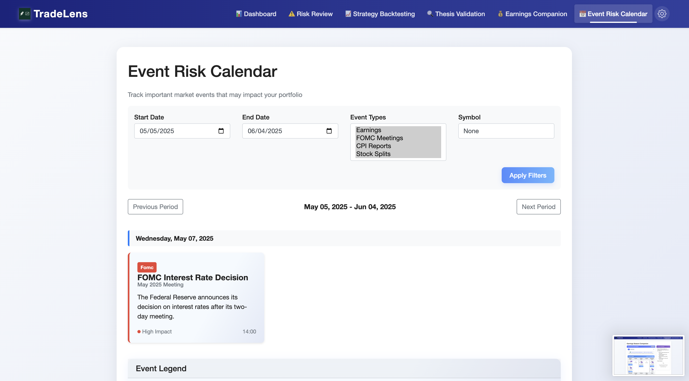

# TradeLens - AI-Powered Stock Portfolio Analysis

<div align="left">
  
</div>

TradeLens emerged as a solution to the challenges faced by investors in navigating the complexities of tariffs, market volatility, and the constant need to sift through news for portfolio-related information. This sophisticated web-based tool leverages advanced AI capabilities from Perplexity to provide a comprehensive platform for analyzing and visualizing stock portfolios. By uploading your stock transactions, you can gain valuable insights through interactive visualizations, risk assessments, and AI-driven analysis, making it easier to manage and optimize your investments amidst ever-changing market conditions.

## 📸 Screenshots & Features

### Platform Overview

A comprehensive view of the TradeLens platform, showing the portfolio management interface with interactive charts, transaction data, and AI-powered analytics in a unified dashboard experience.

### Main Dashboard

The comprehensive dashboard provides an at-a-glance view of your entire portfolio. The interface includes interactive charts for visualizing stock performance, transaction history, and portfolio composition. The right panel features the Perplexity-powered chat assistant that allows natural language queries about your investments.

### Perplexity AI Integration

#### Model Selection

Choose from various Perplexity AI models to power your analysis. Each model offers different capabilities, from quick answers to deep financial reasoning.

#### Model Dropdown Interface

The dropdown interface allows you to select the appropriate Perplexity model based on your analysis needs - whether you need quick market updates or in-depth investment research.

### Earnings Analysis

TradeLens provides comprehensive earnings analysis powered by Perplexity's Sonar model. Get detailed research on upcoming earnings announcements, historical patterns, and projected performance to make informed decisions before earnings releases.

### Risk Assessment

The Sonar Pro model delivers sophisticated risk analysis for your portfolio. Identify potential vulnerabilities, assess exposure to various market factors, and receive AI-powered recommendations to optimize your risk-return profile.

### Event Risk Calendar

Stay ahead of market-moving events with the Event Risk Calendar. TradeLens uses Perplexity AI to analyze how upcoming earnings reports, economic data releases, and geopolitical developments might impact your specific holdings. The calendar highlights critical dates and provides AI-generated insights about potential market impacts.

## Key Features

### Core Functionality
- 📊 **Interactive Visualizations**: Dynamic stock price charts with buy/sell indicators
- 📈 **Transaction History**: Comprehensive view of all your trades with performance metrics
- 🔍 **Smart Filtering**: Categorize and analyze stocks by groups (MAG7, Other, Unlisted)
- 💼 **Portfolio Composition**: Visual breakdown of asset allocation and sector exposure

### AI-Powered Analysis
- 🤖 **Perplexity API Integration**: Leveraging advanced financial analysis capabilities
  - Deep market research for investment decisions
  - Real-time financial data analysis
  - Multiple model options (sonar, sonar-pro, sonar-reasoning, etc.)
- 💡 **Investment Thesis Validation**: Test your investment hypotheses with AI analysis
- 📊 **Earnings Season Companion**: AI-driven earnings preparation and analysis
- ⚠️ **Portfolio Risk Assessment**: Identify and analyze risk factors

### Advanced Features
- 📅 **Event Risk Calendar**: Track market-moving events that could impact your portfolio  
- 📈 **Strategy Backtesting**: Test investment strategies against historical data
- 🌐 **Tariff & Geopolitical Risk Analysis**: Assess external factors affecting your holdings
- 🤔 **Natural Language Queries**: Ask questions about your portfolio in plain English

## Getting Started

### Prerequisites

- Python 3.8 or higher
- pip (Python package installer)
- Perplexity API key (set in .env file)

### Installation

1. Clone the repository
```bash
git clone https://github.com/yourusername/tradelens.git
cd tradelens
```

2. Create and activate a virtual environment
```bash
python -m venv venv
source venv/bin/activate  # On Windows, use: venv\Scripts\activate
```

3. Install dependencies
```bash
pip install -r requirements.txt
```

4. Set up your environment variables
```bash
cp .env.example .env
# Edit .env to add your Perplexity API key
```

### Running the Application

1. Start the server
```bash
./run_server.sh
```

2. Open your browser and navigate to:
```
http://localhost:5000
```

3. Upload your transaction data and start exploring your portfolio with AI-powered insights

## Technology Stack

- **Backend**: Python, Flask
- **Frontend**: HTML, CSS, JavaScript, Chart.js
- **AI Integration**: Perplexity API
- **Data Storage**: SQLite
- **Data Processing**: Pandas, NumPy

## Contributing

Contributions are welcome! Please feel free to submit a Pull Request.