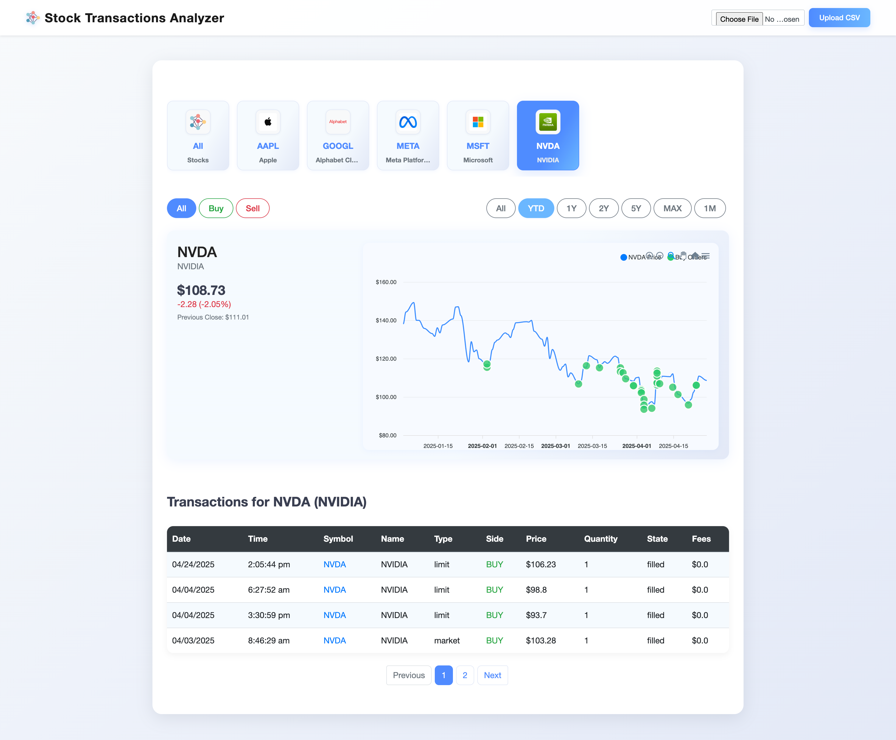

# Robinhood Transaction Analyzer

<div align="left">
  
</div>

A web-based tool to analyze and visualize your Robinhood stock transactions. Upload your stock orders CSV file and get detailed insights with interactive charts and transaction history.

## 📸 Screenshot



## Features

- 📊 Interactive stock price charts with buy/sell indicators
- 📈 Transaction history visualization
- 🔍 Filter transactions by:
  - Stock symbol (MAG7 stocks, Other stocks, Unlisted)
  - Transaction type (Buy/Sell)
  - Time range (YTD, 1Y, 2Y, 5Y, MAX)
- 📱 Responsive design for desktop and mobile
- 🎯 Click on chart markers to highlight corresponding transactions
- 📂 Easy CSV file upload
- 💼 MAG7 stocks categorization
- 🤖 AI-powered chat assistant with:
  - OpenAI integration
  - Perplexity API fallback
  - Basic fallback mode without API keys

## Getting Started

### Prerequisites

- Python 3.8 or higher
- pip (Python package installer)

### Installation

1. Clone the repository
```bash
git clone https://github.com/yourusername/robinhood-transaction-analyzer.git
cd robinhood-transaction-analyzer
```

2. Create and activate a virtual environment
```bash
python -m venv venv
source venv/bin/activate  # On Windows, use: venv\Scripts\activate
```

3. Install dependencies
```bash
pip install -r requirements.txt
```

### Running the Application

1. Start the server
```bash
./run_server.sh
```

2. Open your browser and navigate to:
```
http://localhost:5000
```

3. (Optional) Setup with AI chat capabilities:
```bash
./setup_env.sh YOUR_OPENAI_API_KEY [YOUR_PERPLEXITY_API_KEY]
```
If the OpenAI API encounters rate limits or errors, the system will automatically fall back to Perplexity AI if a key is provided.

### Data Format

Upload your Robinhood stock orders CSV file with the following columns:
- Symbol
- Name
- AveragePrice
- Qty
- Type
- Side
- Fees
- State
- Date (MM/DD/YYYY)
- Time

### Clean Up

To clean the environment and start fresh:
```bash
./clean.sh
```
This will remove:
- Database file
- Uploaded CSV file
- Python cache files
- Log files

## Features in Detail

### Stock Categories
- **MAG7 Stocks**: Meta, Apple, Amazon, Alphabet, Microsoft, NVIDIA, Tesla
- **Other Stocks**: All other listed stocks
- **Unlisted**: Stocks no longer trading or delisted

### Chart Features
- Interactive price history
- Buy/Sell markers
- Zoom and pan controls
- Custom tooltips with transaction details
- Responsive design
- Time range selection

### Transaction Table
- Sortable columns
- Transaction highlighting
- Pagination
- Responsive layout

## Contributing

1. Fork the repository
2. Create your feature branch (`git checkout -b feature/AmazingFeature`)
3. Commit your changes (`git commit -m 'Add some AmazingFeature'`)
4. Push to the branch (`git push origin feature/AmazingFeature`)
5. Open a Pull Request

## License

This project is licensed under the MIT License - see the [LICENSE](LICENSE) file for details.

## Acknowledgments

- [ApexCharts.js](https://apexcharts.com/) for the interactive charts
- [Bootstrap](https://getbootstrap.com/) for the responsive design
- [Flask](https://flask.palletsprojects.com/) for the web framework
