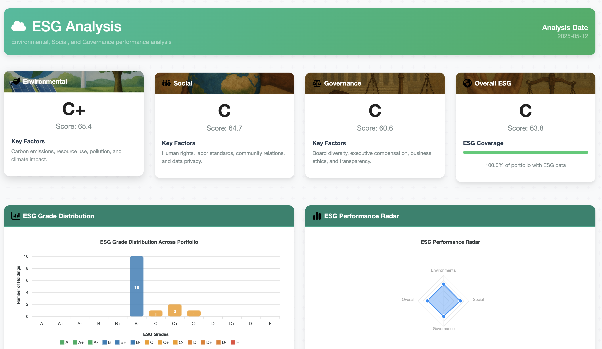

# ESG Analysis

The Environmental, Social, and Governance (ESG) analysis feature in TradeLens provides a comprehensive view of your portfolio's sustainability profile, allowing you to align your investments with your values while also identifying potential long-term risks and opportunities.

## Overview

ESG analysis evaluates companies based on their performance across three critical dimensions:

1. **Environmental (E)**: How a company performs as a steward of the natural environment, including resource usage, carbon emissions, waste management, and climate risk exposure.

2. **Social (S)**: How a company manages relationships with its workforce, the communities in which it operates, and the political environments where it does business.

3. **Governance (G)**: The internal system of practices, controls, and procedures a company adopts to govern itself, make effective decisions, comply with the law, and meet the needs of external stakeholders.

## Key Features

### Portfolio ESG Summary

The dashboard provides an at-a-glance view of your portfolio's overall ESG performance:

- **Overall ESG Score and Grade**: A weighted average of your holdings' ESG scores, converted to an intuitive letter grade from A+ to F.
- **Environmental Score**: Focused assessment of environmental performance.
- **Social Score**: Evaluation of social responsibility factors.
- **Governance Score**: Analysis of corporate governance practices.
- **Coverage Indicator**: Shows what percentage of your portfolio has available ESG data.

### Company-Specific ESG Profiles

For each holding in your portfolio:

- **Individual ESG Scores**: See how each company performs across all three ESG dimensions.
- **Sector Comparison**: Benchmark each company against industry peers.
- **Historical Trends**: Track how ESG profiles evolve over time.
- **Controversy Flags**: Highlight recent ESG controversies that might impact performance.

### Recommendations

The system generates actionable recommendations to improve your portfolio's ESG profile:

- **High Priority**: Critical ESG issues that may present material financial risks.
- **Medium Priority**: Significant concerns that should be monitored.
- **Low Priority**: Minor issues or opportunities for marginal improvement.

Each recommendation includes a rationale and suggested actions.

### Notes System

Track ESG developments related to your holdings:

- **Company-Specific Notes**: Document ESG-related news or research for specific companies.
- **Timestamp Tracking**: Keep a chronological record of ESG developments.
- **Custom Annotations**: Add personal insights or follow-up items.

## How to Use

### Accessing the ESG Dashboard

The ESG dashboard is fully integrated into TradeLens. To access it:

1. Log in to your TradeLens account
2. Navigate to the ESG Analysis section from the main navigation menu
3. Your portfolio's ESG data will be automatically analyzed and displayed

### Interpreting ESG Scores

ESG scores in TradeLens follow this grading system:

| Grade | Score Range | Interpretation |
|-------|-------------|----------------|
| A+    | 95-100      | Exceptional    |
| A     | 90-94.9     | Excellent      |
| A-    | 85-89.9     | Very Good      |
| B+    | 80-84.9     | Good           |
| B     | 75-79.9     | Above Average  |
| B-    | 70-74.9     | Average        |
| C+    | 65-69.9     | Below Average  |
| C     | 60-64.9     | Needs Improvement |
| C-    | 55-59.9     | Poor           |
| D+    | 50-54.9     | Very Poor      |
| D     | 45-49.9     | Concerning     |
| D-    | 40-44.9     | Highly Concerning |
| F     | <40         | Failing        |

### Adding ESG Notes

To add notes about ESG developments for specific companies:

1. Navigate to the ESG Notes section
2. Select the company symbol from the dropdown
3. Enter your note text
4. Click "Save Note"

### Refreshing ESG Data

ESG data is automatically refreshed on a regular schedule, but you can manually update it:

1. Go to the Settings page
2. Under "Data Refresh Options," click "Refresh ESG Data"

Alternatively, use the refresh button on the ESG dashboard itself.

## Benefits of ESG Analysis

### Risk Management

ESG analysis helps identify non-financial risks that may eventually become financial risks:

- **Regulatory Risks**: Companies with poor environmental practices may face stricter regulations or fines.
- **Reputation Risks**: Poor ESG practices can damage brand value and customer loyalty.
- **Operational Risks**: Weak governance can lead to mismanagement or corruption.
- **Market Risks**: Poor ESG performers may lose access to certain markets or customers.

### Long-term Value Creation

Research suggests that companies with strong ESG practices often demonstrate:

- Better operational efficiency
- Reduced risk of catastrophic losses
- Stronger stakeholder relationships
- Greater innovation potential
- Better talent attraction and retention

### Values Alignment

ESG analysis helps you:

- Align your investments with your personal or organizational values
- Identify companies making positive contributions to sustainability goals
- Avoid investments in practices you may find objectionable
- Support companies leading positive change in their industries

## Technical Implementation

TradeLens sources ESG data from multiple providers and proprietary algorithms to create a comprehensive view:

- **Core ESG Metrics**: Obtained from industry-leading ESG data providers.
- **Sentiment Analysis**: AI-powered analysis of news and social media.
- **Transaction Pattern Analysis**: Evaluation of trading patterns that may reflect ESG sentiment.
- **Sector Benchmarking**: Comparison against sector-specific ESG baselines.

The system employs sophisticated weighting methodologies to account for:

- Portfolio allocation (larger holdings have more impact on total score)
- Data recency and reliability
- Sector-specific materiality factors

## Best Practices

For optimal use of the ESG analysis feature:

1. **Check coverage indicator**: Ensure sufficient data is available for meaningful analysis.
2. **Focus on material issues**: Prioritize ESG factors most relevant to each company's industry.
3. **Consider trend direction**: Improving ESG scores may be more important than absolute values.
4. **Use in conjunction with financial analysis**: ESG should complement, not replace, financial evaluation.
5. **Document your observations**: Use the notes feature to track developments and your insights.

---

The ESG analysis feature represents TradeLens' commitment to providing investors with a comprehensive view of both financial and non-financial factors that drive long-term investment performance and sustainability. 